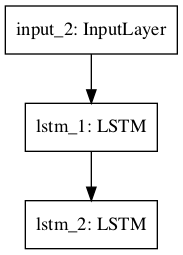
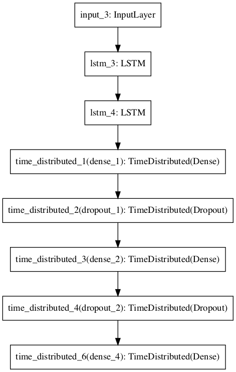
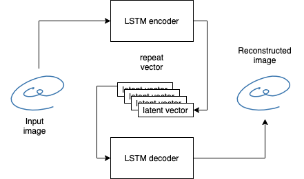
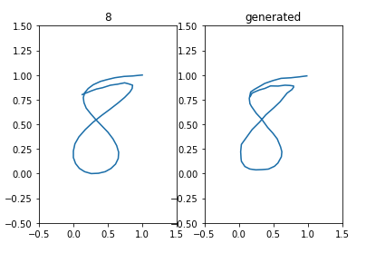
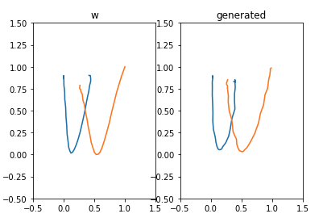
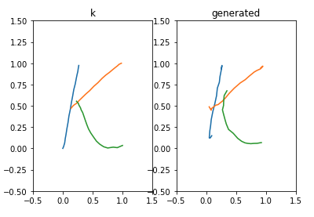

[keras] Dataset Augmentation in Feature Space
===
Tensorflow implementation is provided as the following link.  
https://github.com/YeongHyeon/Sequence-Autoencoder

## Architecture
### Encoder
  

### Decoder
  

## Problem Definition
Recunstruct pen sequence.  
 

## Result
- Result of simple reconstruction  
 
 
 
- Result of latent space interpolation and extrapolation  
 

## Environment
- Python : 3.7.10  
- Tensorflow ; 2.4.1  
- keras : 2.4.3  
- Numpy : 1.19.5  

## Reference
[1] Terrance DeVries, Graham W. Taylor. (2017). <a href="https://arxiv.org/abs/1702.05538">Dataset Augmentation in Feature Space</a>. arXiv preprint arXiv:1702.05538.  